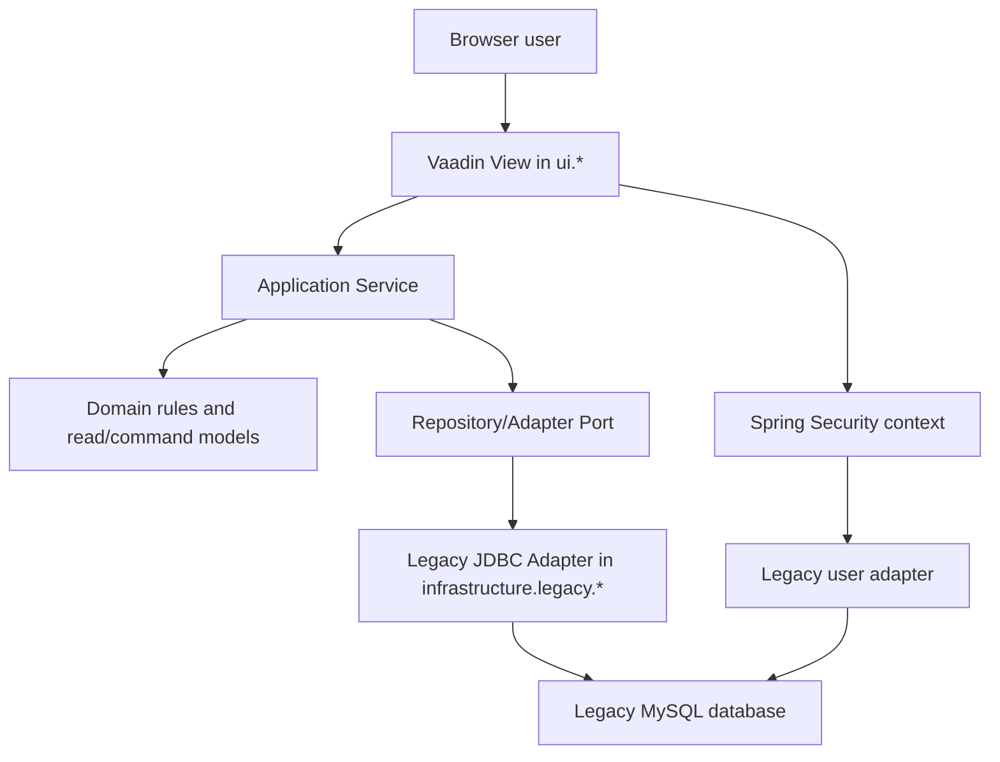

# Phase 5: Propor arquitetura do salome-core - Research

**Researched:** 2026-05-13
**Domain:** arquitetura Java/Spring/Vaadin para migracao read-first de financeiro legado
**Confidence:** HIGH

<user_constraints>
## User Constraints (from CONTEXT.md)

### Locked Decisions
- **D-01:** Reaproveitar a identidade legada como fonte de verdade para o usuario corrente, mas centralizar autenticacao e autorizacao em Spring Security no novo modulo.
- **D-02:** Criar um adapter para mapear o legado (`Conecta.getUsuario()`, `UsuarioController`, tabelas `usuario`/`usuarioalerta`) para `Principal`, authorities e contexto de request/session no novo sistema.
- **D-03:** Usar arquitetura em camadas no topo (`ui`, `application`, `domain`, `infrastructure`, `security`) com subpacotes por funcionalidade dentro de cada layer para evitar mega-pacotes e manter crescimento controlado.
- **D-04:** Implementar repositories/adapters em `infrastructure` com JDBC/JdbcTemplate sobre MySQL, porque o legado ja expoe SQL claro e o schema existente precisa ser lido com controle direto.
- **D-05:** Projetar esses repositories como CRUD-capable desde o inicio, mas manter a primeira entrega do fluxo em leitura somente; escrita, delete e baixa continuam para as fases posteriores e testadas.
- **D-06:** A arquitetura deve suportar CRUD completo no futuro, mas a fase atual preserva a ordem do roadmap: primeiro arquitetura, depois leitura web validada, depois mutacoes.

### the agent's Discretion
- Definir a organizacao exata dos subpacotes por bounded context.
- Definir o mapeamento fino das authorities no Spring Security.

### Deferred Ideas (OUT OF SCOPE)
- Full CRUD across the web module is deferred to later implementation phases; Phase 5 only defines the architecture that will support it.
- The first Vaadin slice stays read-only in the roadmap even though the repositories are designed to support writes later.
</user_constraints>

<architectural_responsibility_map>
## Architectural Responsibility Map

| Capability | Primary Tier | Secondary Tier | Rationale |
|------------|--------------|----------------|-----------|
| Vaadin screens for Contas a Pagar | `ui` | `application` | Views must render state and call services; no SQL or heavy financial rule belongs in the View. |
| Finance use cases and read orchestration | `application` | `domain` | Services own cases such as query, future save, exclusion and baixa orchestration. |
| Financial invariants | `domain` | `application` | Rules such as vencimento, baixa, rateio and auditability need isolated testable logic before mutation phases. |
| Legacy MySQL access | `infrastructure.legacy` | `application` | JDBC/JdbcTemplate adapters should encapsulate SQL and table joins against the legacy schema. |
| Current user and permissions | `security` | `infrastructure.legacy.security` | Spring Security owns principal/authorities while adapters read legacy user semantics. |
| Schema evolution | `infrastructure.migration` | `docs` | Flyway is required for future schema changes, but Phase 5 must not create migrations or alter production. |
</architectural_responsibility_map>

<research_summary>
## Summary

The phase is a documentation and architecture contract phase. It should not create the Spring Boot/Vaadin project yet, and it should not touch `salome-legacy` or the production database. The research target is therefore the shape of the future module: which responsibilities belong in `ui`, `application`, `domain`, `infrastructure` and `security`, and how the first read-only slice can avoid copying the Swing/MVC coupling.

The legacy maps show that `ContasPagar.java` and `NotaCompra*.java` mix UI events, SQL, transaction handling and financial rules. The safest architecture is a layered Spring Boot module where Vaadin Views depend on application services, services depend on ports/repositories, and JDBC adapters isolate legacy MySQL SQL. Identity should be adapted into Spring Security instead of leaking `Conecta.getUsuario()` semantics into Vaadin.

**Primary recommendation:** produce a concise architecture proposal document for `salome-core` that locks package boundaries, dependency direction, read-first policy, legacy adapter responsibilities, security integration and test expectations for later financial mutation phases.
</research_summary>

<standard_stack>
## Standard Stack

### Core

| Library | Version | Purpose | Why Standard |
|---------|---------|---------|--------------|
| Java | 25 | Runtime/language target for the new module | Project constraint and future module baseline. |
| Spring Boot | 4 | Application container, configuration, dependency injection | Project constraint and natural host for services, repositories and security. |
| Vaadin | current compatible with Spring Boot 4 | Server-side web UI | Project constraint for replacing Swing screens with browser UI. |
| Spring Security | compatible with Spring Boot 4 | Authentication and authorization | Required to centralize identity and authorities outside Swing. |
| Spring JDBC/JdbcTemplate | compatible with Spring Boot 4 | SQL access to legacy MySQL | Matches the legacy SQL-heavy schema without forcing premature ORM mapping. |
| Flyway | compatible with Spring Boot 4 | Versioned schema changes | Required by project governance for future schema changes. |
| MySQL Connector/J | compatible with Java 25 | MySQL connectivity | Required to read the legacy database. |

### Supporting

| Library | Version | Purpose | When to Use |
|---------|---------|---------|-------------|
| JUnit 5 | current | Unit and integration tests | Required for critical financial rules before mutation phases. |
| Testcontainers MySQL | current | Isolated DB integration tests | Useful once repositories and financial mutations appear. |
| AssertJ | current | Fluent assertions | Useful for readable finance rule tests. |

### Alternatives Considered

| Instead of | Could Use | Tradeoff |
|------------|-----------|----------|
| JdbcTemplate | JPA/Hibernate | JPA can be useful later, but the legacy schema and existing query maps favor explicit SQL for the first migration. |
| Direct reuse of legacy DAOs | Adapter over `ContasPagarData`/`NotaCompraData` | Faster superficially, but couples the new app to Swing-era globals, transactions and mutable beans. |
| Vaadin View doing queries | SQL in View | Recreates the legacy problem and violates project rules. |
</standard_stack>

<architecture_patterns>
## Architecture Patterns

### System Architecture Diagram



### Recommended Project Structure

```text
src/main/java/br/com/salome/core/
  ui/
    contaspagar/
  application/
    contaspagar/
    notacompra/
    financeiro/
    cadastros/
  domain/
    contaspagar/
    notacompra/
    financeiro/
    cadastros/
  infrastructure/
    legacy/
      contaspagar/
      notacompra/
      financeiro/
      cadastros/
      security/
  security/
docs/
  architecture/
```

### Pattern 1: Layered dependency direction
**What:** `ui` calls `application`; `application` coordinates `domain` and ports; `infrastructure` implements persistence; `security` exposes current-user abstractions.
**When to use:** All future Vaadin features and finance use cases.

### Pattern 2: Read model and command model split
**What:** Query services return projections/read models for Vaadin; later write services accept explicit commands instead of mutable legacy beans with `...Gravar` flags.
**When to use:** Starting with read-only Contas a Pagar and continuing into future write phases.

### Pattern 3: Legacy adapter boundary
**What:** SQL, legacy table names, stored procedure calls and MySQL-specific behavior stay behind `infrastructure.legacy`.
**When to use:** Every access to `ContasPagar`, `NotaCompra`, `NotaCompraDuplicatas`, `Extrato`, `Banco`, `Fornecedor`, `Filial` and `PlanoContas*`.

### Anti-Patterns to Avoid
- **Swing architecture copy:** The new module must preserve behavior, not copy event handlers, mutable beans or SQL in UI.
- **View-owned SQL:** Vaadin Views should never contain query strings, joins or financial filters.
- **Global user leakage:** `Conecta.getUsuario()` semantics should be adapted once and exposed as a request/session principal, not called from UI code.
- **Early writes:** Mutations before a read-only validated slice increase financial risk and violate the roadmap order.
</architecture_patterns>

<dont_hand_roll>
## Don't Hand-Roll

| Problem | Don't Build | Use Instead | Why |
|---------|-------------|-------------|-----|
| Authentication/session plumbing | Custom session global | Spring Security | Handles request/session context, authorities and integration points. |
| SQL execution helpers | A new homemade JDBC layer | Spring JDBC/JdbcTemplate | Provides prepared statements, mapping helpers and transaction integration. |
| Schema change tracking | Manual SQL notes | Flyway migrations | Required for versioned schema governance. |
| Financial transaction boundaries | Manual commit/rollback in UI | Spring transactions in services | Keeps mutation rules testable and out of Vaadin. |
</dont_hand_roll>

<common_pitfalls>
## Common Pitfalls

### Pitfall 1: Treating Phase 5 as implementation
**What goes wrong:** The executor creates the Spring Boot project or starts migrating code.
**Why it happens:** Architecture plans often drift into scaffolding.
**How to avoid:** The plan should create a proposal document only; Phase 6 owns project creation.
**Warning signs:** New `pom.xml`, Java source folders, Flyway scripts or Vaadin files appear during Phase 5.

### Pitfall 2: Hiding legacy rule origins
**What goes wrong:** The architecture says "service validates baixa" without pointing to where baixa rules came from.
**Why it happens:** High-level architecture docs can become generic.
**How to avoid:** The proposal must cite the mapping docs and require source attribution for migrated rules.
**Warning signs:** Missing references to `ContasPagar`, `NotaCompraDuplicatas`, `Extrato`, `Banco` and `UsuarioController` origins.

### Pitfall 3: Overfitting to read-only
**What goes wrong:** The architecture can read data but has no clean place for future writes, audit and tests.
**Why it happens:** The first Vaadin slice is read-only.
**How to avoid:** Document separate read/query services and future command services while keeping initial UI read-only.
**Warning signs:** Repositories named only for screen grids, no command boundary, no test guidance for baixa/exclusao/rateio.
</common_pitfalls>

<open_questions>
## Open Questions

1. **Legacy password storage**
   - What we know: the local snapshot does not include the login implementation or confirmed password hashing.
   - What's unclear: exact credential validation strategy.
   - Recommendation: architecture should define an adapter seam and record this as a pre-production security discovery item, not block Phase 5.

2. **Exact Spring Boot 4 and Vaadin compatible versions**
   - What we know: the stack is mandated by project constraints.
   - What's unclear: exact Maven coordinates will be selected in Phase 6 when the project is created.
   - Recommendation: Phase 5 should state compatibility expectations, leaving concrete dependency versions to Phase 6.
</open_questions>

<sources>
## Sources

### Primary (HIGH confidence)
- `.planning/phases/05-propor-arquitetura-do-salome-core/05-CONTEXT.md` - locked implementation decisions for Phase 5.
- `.planning/PROJECT.md` - project constraints and migration order.
- `.planning/REQUIREMENTS.md` - ARCH-01 through ARCH-04 requirements.
- `.planning/ROADMAP.md` - phase boundaries and downstream sequencing.
- `.planning/codebase/STACK.md` - observed legacy stack.
- `.planning/codebase/ARCHITECTURE.md` - observed legacy layering and extraction boundaries.
- `.planning/codebase/INTEGRATIONS.md` - database, reporting and UI integration points.
- `.planning/codebase/USUARIO-ACESSO-MAPA.md` - current user and permission mapping.
- `.planning/codebase/CONTAS-PAGAR-CLASSES-MAPA-TECNICO.md` - class/rule origins and suggested target mapping.
- `.planning/codebase/CONTAS-PAGAR-MAPA-BANCO-QUERIES.md` - MySQL tables, relationships and query priorities.
</sources>

<metadata>
## Metadata

**Research scope:**
- Core technology: Java 25, Spring Boot 4, Vaadin, Spring Security, JDBC/JdbcTemplate, MySQL and Flyway.
- Patterns: layered architecture, read model vs command model, legacy adapter boundary, Spring Security identity adaptation.
- Pitfalls: premature implementation, SQL in View, missing rule attribution, early writes.

**Confidence breakdown:**
- Standard stack: HIGH - dictated by project constraints and existing maps.
- Architecture: HIGH - directly supported by locked decisions and codebase maps.
- Pitfalls: HIGH - based on concrete legacy findings.
- Code examples: N/A - this phase produces a proposal document, not application code.

**Research date:** 2026-05-13
**Valid until:** 2026-06-12
</metadata>

---

*Phase: 05-propor-arquitetura-do-salome-core*
*Research completed: 2026-05-13*
*Ready for planning: yes*
