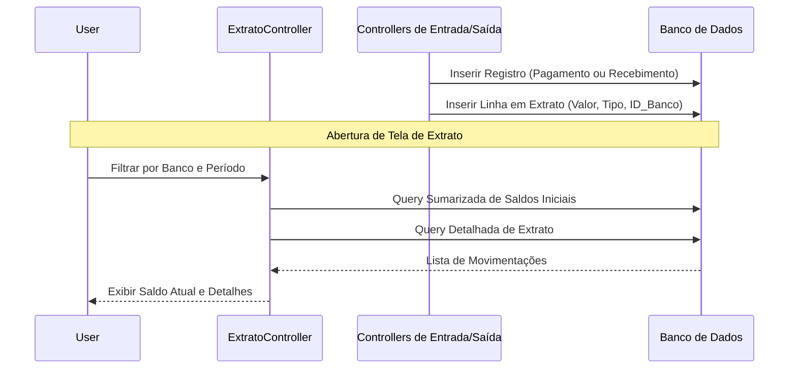
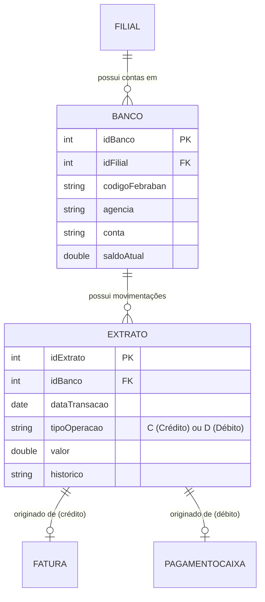

# Design — Módulo banco

> Gerado pelo Redator em 2026-06-08
> Confiança: 🟢 CONFIRMADO | 🟡 INFERIDO | 🔴 LACUNA

## 1. Decisões Arquiteturais
- O `Extrato` não é um repositório centralizado assíncrono. No modelo legado, os controllers de `Faturamento` e `PagamentoCaixa` invocam instâncias de `ExtratoData` ou inserem JDBC raw na tabela de extratos no momento da operação (Event-Driven de forma síncrona). 🟢
- O banco local (da empresa) é fortemente acoplado com filiais para separar o "Caixa" físico da matriz e das filiais. 🟡

## 2. Diagrama de Fluxo Principal (Mermaid)

Fluxo Genérico de Conciliação Financeira (Caixa e Banco):

## 3. Modelo de Dados Relacional (Core)

