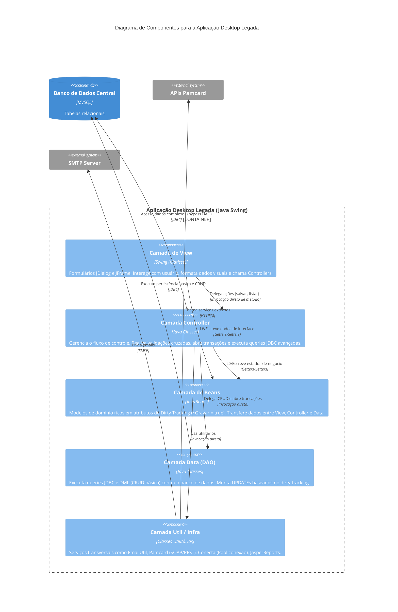

# Diagrama C4 — Nível 3: Componentes

> Gerado pelo Arquiteto em 2026-06-08
> Foco: **Container Aplicação Desktop Legada**

> **Nota sobre o Bypass:** O Diagrama ilustra a dívida técnica onde a camada Controller faz Bypass do DAO e se conecta diretamente ao Banco de Dados (via `Conecta.getCon()`) para executar queries com agregação e Joins pesados.
