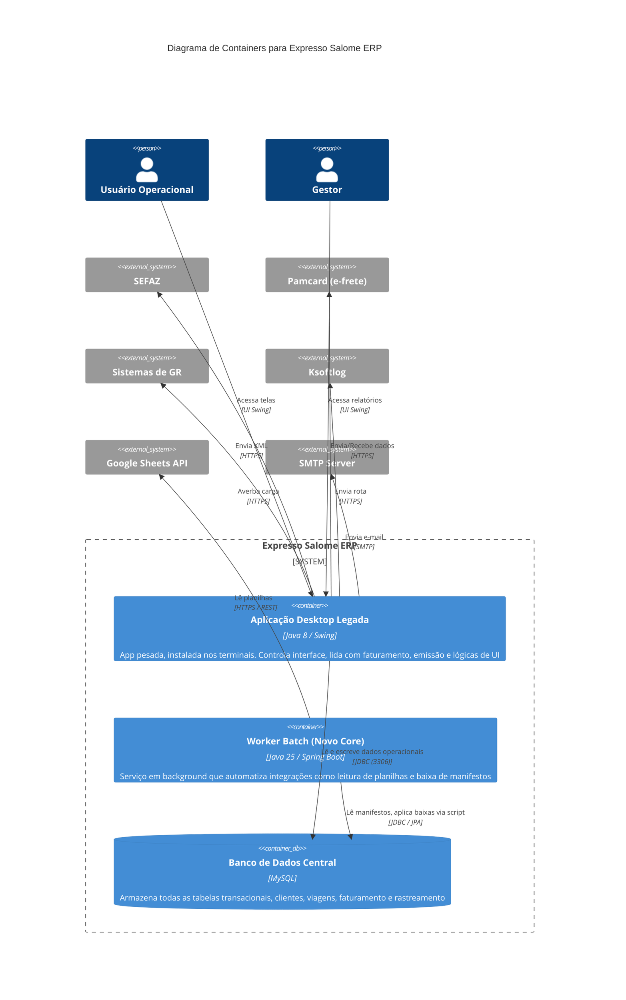

# Diagrama C4 — Nível 2: Containers

> Gerado pelo Arquiteto em 2026-06-08

> **Nota Arquitetural:** Há uma forte dívida técnica onde o `app_desktop` se conecta diretamente ao `db` sem intermédio de uma API. Qualquer nova funcionalidade tem que lidar com as lógicas implementadas isoladamente dentro do Swing (fat-client). O `app_batch` (Spring Boot) é uma primeira tentativa de desacoplar processos do cliente desktop.
