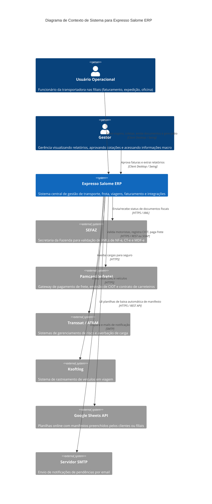

# Diagrama C4 — Nível 1: Contexto

> Gerado pelo Arquiteto em 2026-06-08

```mermaid
C4Context
    title Diagrama de Contexto de Sistema para Expresso Salome ERP

    Person(user_operacional, "Usuário Operacional", "Funcionário da transportadora nas filiais (faturamento, expedição, oficina)")
    Person(user_gestor, "Gestor", "Gerência visualizando relatórios, aprovando cotações e acessando informações macro")

    System(erp_salome, "Expresso Salome ERP", "Sistema central de gestão de transporte, frota, viagens, faturamento e integrações")

    System_Ext(sefaz, "SEFAZ", "Secretaria da Fazenda para validação de XMLs de NF-e, CT-e e MDF-e")
    System_Ext(pamcard, "Pamcard (e-frete)", "Gateway de pagamento de frete, emissão de CIOT e contrato de carreteiros")
    System_Ext(gerenciamento_risco, "Transsat / AT&M", "Sistemas de gerenciamento de risco e averbação de carga")
    System_Ext(rastreamento, "Ksoftlog", "Sistema de rastreamento de veículos em viagem")
    System_Ext(google_sheets, "Google Sheets API", "Planilhas online com manifestos preenchidos pelos clientes ou filiais")
    System_Ext(smtp, "Servidor SMTP", "Envio de notificações de pendências por email")

    Rel(user_operacional, erp_salome, "Gere viagens, coletas, emite documentos e gere pátio", "Client Desktop / Swing")
    Rel(user_gestor, erp_salome, "Aprova faturas e extrai relatórios", "Client Desktop / Swing")

    Rel(erp_salome, sefaz, "Envia/recebe status de documentos fiscais", "HTTPS / XML")
    Rel(erp_salome, pamcard, "Valida motoristas, registra CIOT, paga frete", "HTTPS / REST ou SOAP")
    Rel(erp_salome, gerenciamento_risco, "Averba cargas para seguro", "HTTPS")
    Rel(erp_salome, rastreamento, "Envia rotas (SM) e veículos", "HTTPS")
    Rel(erp_salome, google_sheets, "Lê planilhas de baixa automática de manifesto", "HTTPS / REST API")
    Rel(erp_salome, smtp, "Dispara e-mails de notificação", "SMTP")
```
