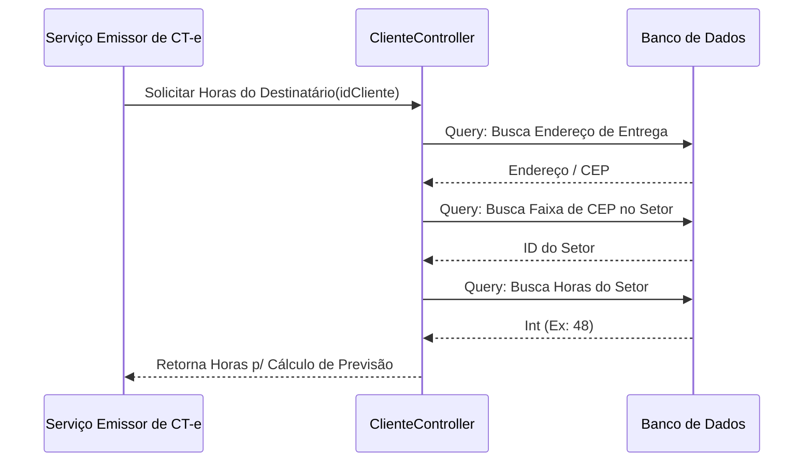
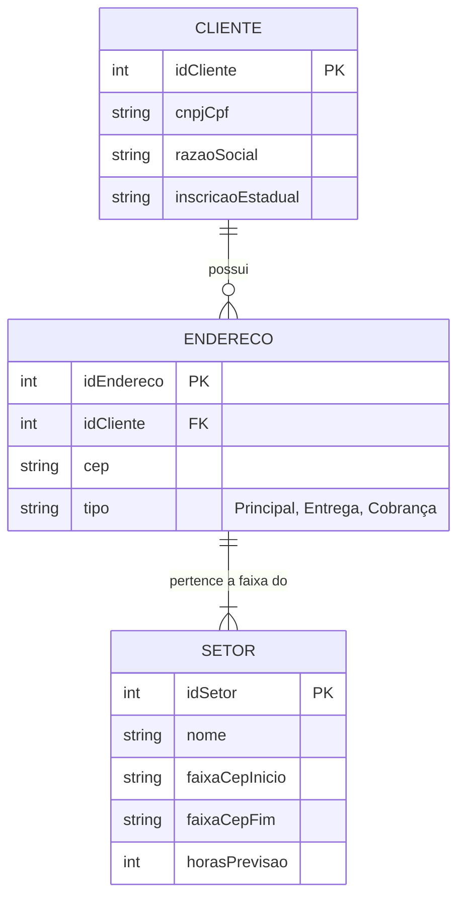

# Design — Módulo cliente

> Gerado pelo Redator em 2026-06-08
> Confiança: 🟢 CONFIRMADO | 🟡 INFERIDO | 🔴 LACUNA

## 1. Decisões Arquiteturais
- O cadastro de cliente no legado suporta múltiplos endereços através de uma tabela filho (normalizada). O cálculo de setor (`getHorasSetor`) utiliza uma tabela estática de CEPs na base local. 🟢

## 2. Diagrama de Fluxo Principal (Mermaid)

Fluxo de Resolução de Setor para Previsão de Entrega:

## 3. Modelo de Dados Relacional (Core)

