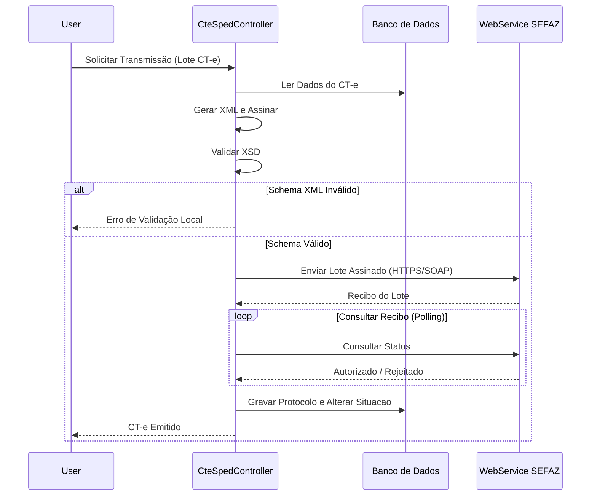
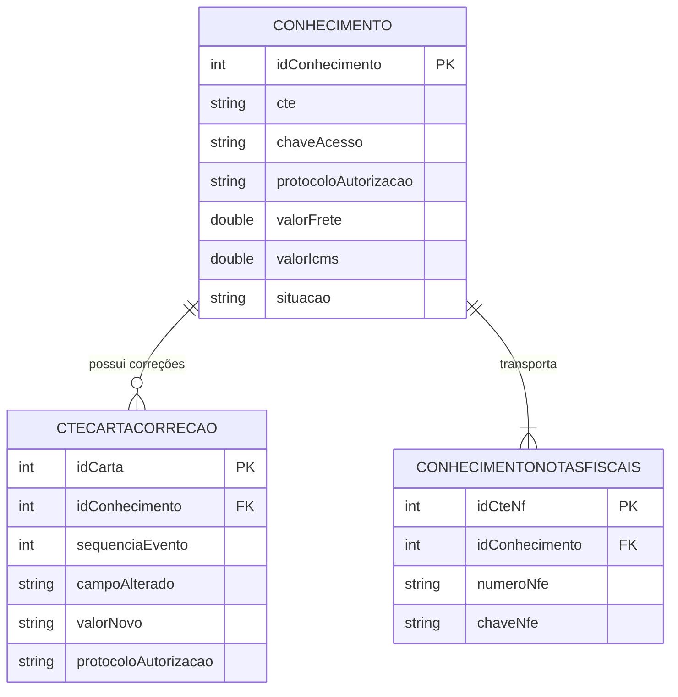

# Design — Módulo cte

> Gerado pelo Redator em 2026-06-08
> Confiança: 🟢 CONFIRMADO | 🟡 INFERIDO | 🔴 LACUNA

## 1. Decisões Arquiteturais
- O envio e validação de arquivos para a SEFAZ está centralizado nas classes `CteSpedController`, que processam o certificado A1/A3, assinam o XML e abrem socket HTTPS com os WebServices da Sefaz correspondente à UF da filial emissora. 🟢
- As correções (Carta de Correção) não atualizam a entidade principal de Conhecimento, mas geram eventos em anexo (tabela filha) para manter o histórico inalterável do documento fiscal original. 🟡

## 2. Diagrama de Fluxo Principal (Mermaid)

Fluxo de Emissão de CT-e no SPED:

## 3. Modelo de Dados Relacional (Core)

