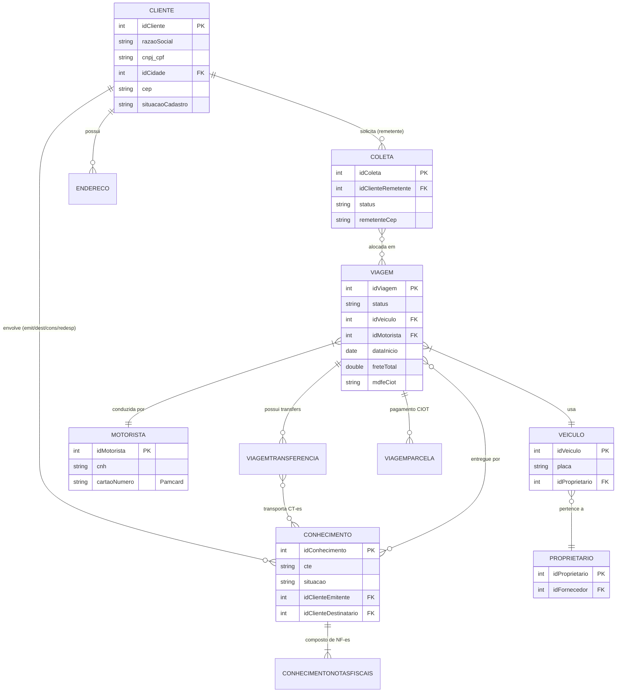

# Diagrama Entidade-Relacionamento (ERD) — Legado

> Gerado pelo Arquiteto em 2026-06-08
> Foco: Principais Entidades Logísticas e Financeiras

```mermaid
erDiagram
    CLIENTE ||--o{ COLETA : "solicita (remetente)"
    CLIENTE ||--o{ CONHECIMENTO : "envolve (emit/dest/cons/redesp)"
    CLIENTE ||--o{ ENDERECO : "possui"
    
    COLETA }o--o{ VIAGEM : "alocada em"
    CONHECIMENTO }o--o{ VIAGEM : "entregue por"
    
    VIAGEM }|--|| VEICULO : "usa"
    VIAGEM }|--|| MOTORISTA : "conduzida por"
    
    VEICULO }o--|| PROPRIETARIO : "pertence a"
    
    CONHECIMENTO ||--|{ CONHECIMENTONOTASFISCAIS : "composto de NF-es"
    
    VIAGEM ||--o{ VIAGEMTRANSFERENCIA : "possui transfers"
    VIAGEMTRANSFERENCIA }o--o{ CONHECIMENTO : "transporta CT-es"
    
    VIAGEM ||--o{ VIAGEMPARCELA : "pagamento CIOT"
    
    CLIENTE {
        int idCliente PK
        string razaoSocial
        string cnpj_cpf
        int idCidade FK
        string cep
        string situacaoCadastro
    }

    VIAGEM {
        int idViagem PK
        string status
        int idVeiculo FK
        int idMotorista FK
        date dataInicio
        double freteTotal
        string mdfeCiot
    }

    CONHECIMENTO {
        int idConhecimento PK
        string cte
        string situacao
        int idClienteEmitente FK
        int idClienteDestinatario FK
    }

    COLETA {
        int idColeta PK
        int idClienteRemetente FK
        string status
        string remetenteCep
    }

    VEICULO {
        int idVeiculo PK
        string placa
        int idProprietario FK
    }

    MOTORISTA {
        int idMotorista PK
        string cnh
        string cartaoNumero "Pamcard"
    }

    PROPRIETARIO {
        int idProprietario PK
        int idFornecedor FK
    }
```
