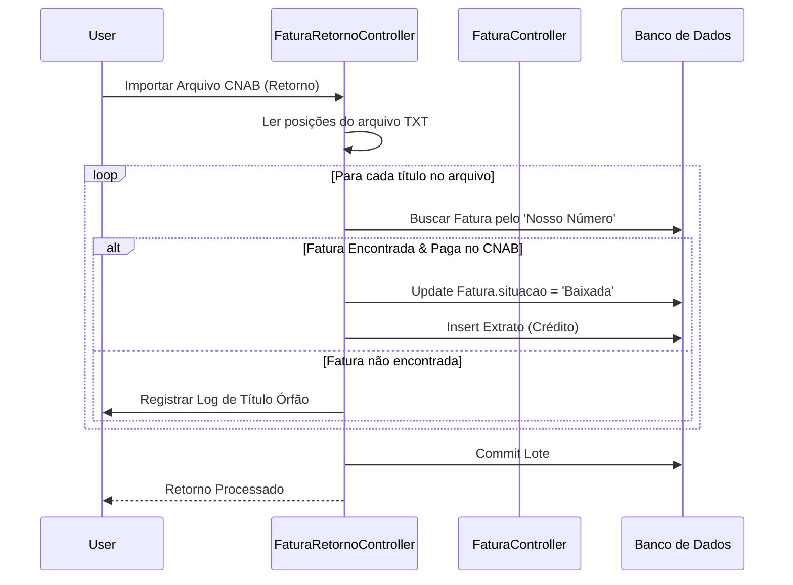
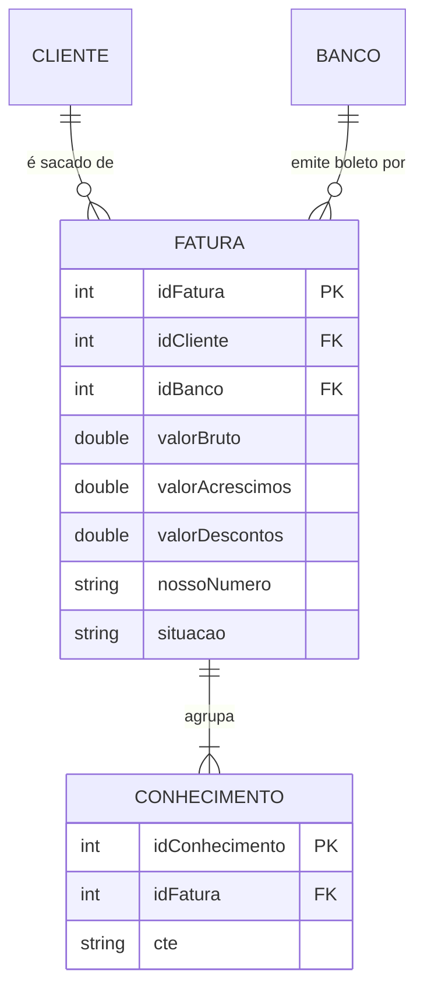

# Design — Módulo faturamento

> Gerado pelo Redator em 2026-06-08
> Confiança: 🟢 CONFIRMADO | 🟡 INFERIDO | 🔴 LACUNA

## 1. Decisões Arquiteturais
- O controle de retorno CNAB no legado é processado proceduralmente dentro de `FaturaRetornoController.java`, que faz a leitura posicional (substrings) do arquivo texto do banco.
- Ao baixar a fatura (`FaturaBaixaController`), o sistema executa DML direto para atualizar o status da fatura para "Baixada" e injeta a entrada no extrato bancário numa única transação via `Conecta`. 🟢

## 2. Diagrama de Fluxo Principal (Mermaid)

Fluxo de Retorno e Baixa Bancária:

## 3. Modelo de Dados Relacional (Core)

