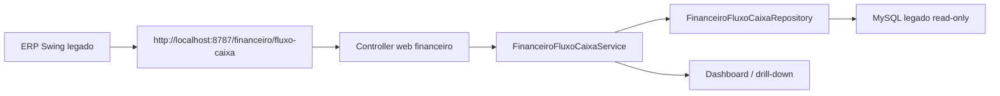

# Design - Modulo financeiro fluxo de caixa

## Arquitetura

O modulo financeiro fica no `salome-core`, separado do batch de manifesto. Ele le o MySQL legado somente por repositorios explicitos e nunca escreve no legado.

## Modelo de leitura

Cada movimento normalizado deve carregar:

| Campo | Finalidade |
| --- | --- |
| `natureza` | Receita ou despesa |
| `status` | Previsto ou realizado |
| `origemTipo` | Nota compra, extrato, pagamento caixa, fatura, CT-e aberto |
| `origemId` | ID final no legado para drill-down |
| `dataCompetencia`, `dataVencimento`, `dataBaixa` | Eixos do fluxo |
| `valor` | Valor financeiro normalizado positivo |
| `banco`, `clienteFornecedor`, `centroCusto`, `planoContas`, `dmr` | Agrupamentos |
| `documento`, `historico` | Explicacao operacional |
| `LegacyOrigin` | Classe, metodo/botao, DAO/query e tabela de origem |

## Drill-down

1. Dashboard executivo.
2. Serie diaria/mensal.
3. DMR e plano de contas.
4. Centro de custo.
5. Banco/caixa.
6. Documento.
7. Origem final no legado.

## UX

Interface clara e corporativa inspirada em sistemas TOTVS, SAP, Sankhya e Omie:

- barra lateral compacta;
- filtros persistentes no topo;
- KPIs com variacao e contexto;
- graficos de previsto x realizado;
- tabela densa com busca rapida;
- painel lateral de drill-down;
- cores claras: azul petroleo, verde financeiro, branco, cinzas e acentos discretos.
