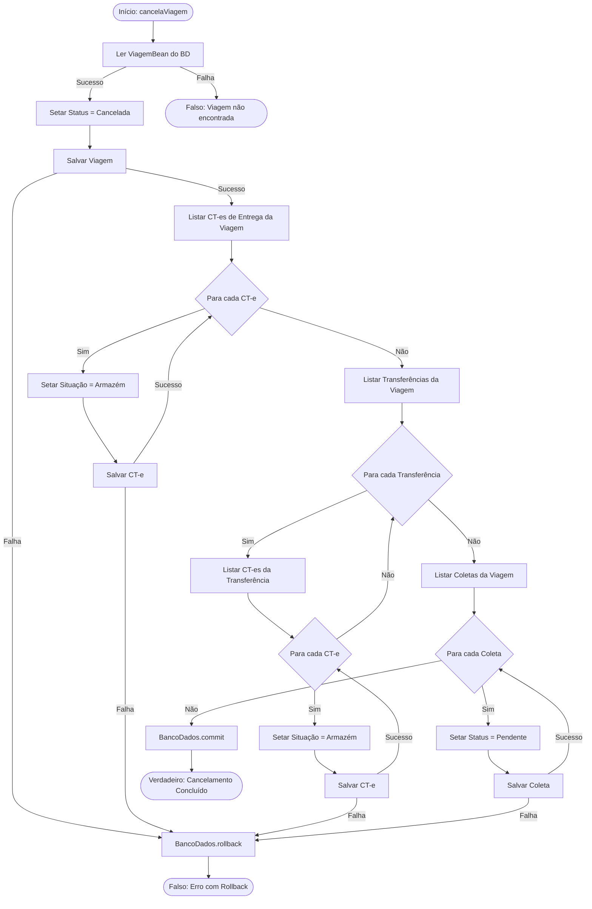
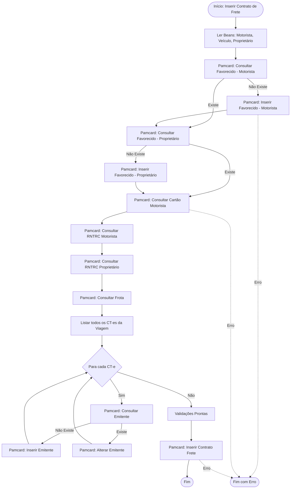

# Fluxogramas — Módulo Viagem

> Gerado pelo Arqueólogo em 2026-06-08
> Foco: `salome-legacy/` — `ViagemController.java`

## Fluxo de Cancelamento de Viagem (`cancelaViagem`)

Este fluxo descreve as etapas sequenciais e transacionais do cancelamento de uma viagem.

## Fluxo de Inserção de Contrato de Frete Pamcard (`inserirContratoFrete`)

Executado de forma assíncrona (`SwingWorker`) para integrar a viagem com o serviço CIOT Pamcard.

