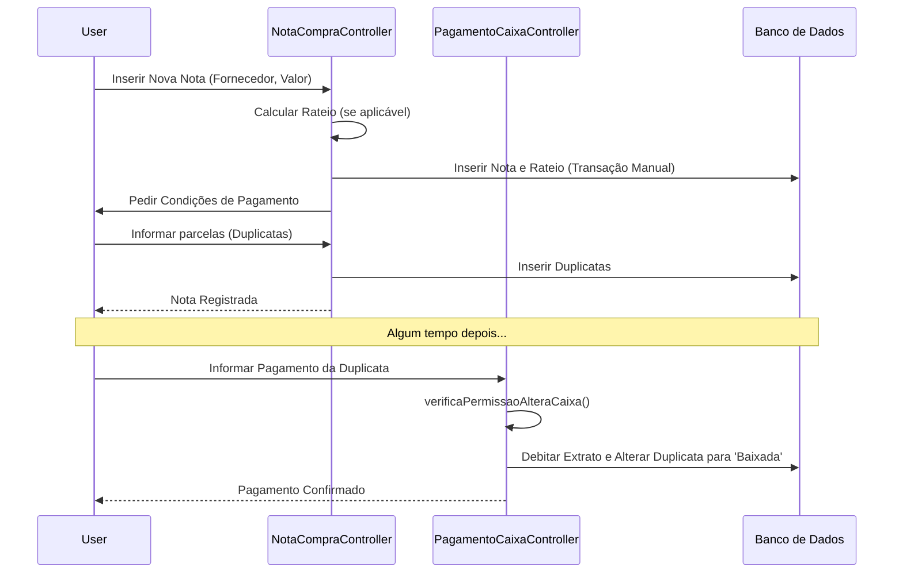
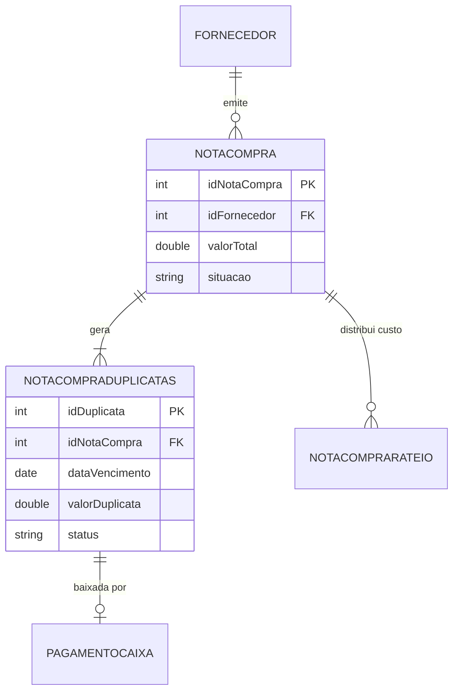

# Design — Módulo nota-compra

> Gerado pelo Redator em 2026-06-08
> Confiança: 🟢 CONFIRMADO | 🟡 INFERIDO | 🔴 LACUNA

## 1. Decisões Arquiteturais
- O registro de notas de compra no legado é fortemente acoplado à interface `NotaCompra.java`, que orquestra a geração de duplicatas através da delegação ao `NotaCompraDuplicatasController`.
- A persistência utiliza o padrão Dirty-Tracking dos Beans (`*Gravar = true`) acoplado ao JDBC dinâmico, manipulando tabelas `notacompra`, `notacompraduplicatas`, `notacomprarateio` e `pagamentocaixa`. 🟢

## 2. Diagrama de Fluxo Principal (Mermaid)

Fluxo de Inserção de Nota e Baixa de Duplicata:

## 3. Modelo de Dados Relacional (Core)

