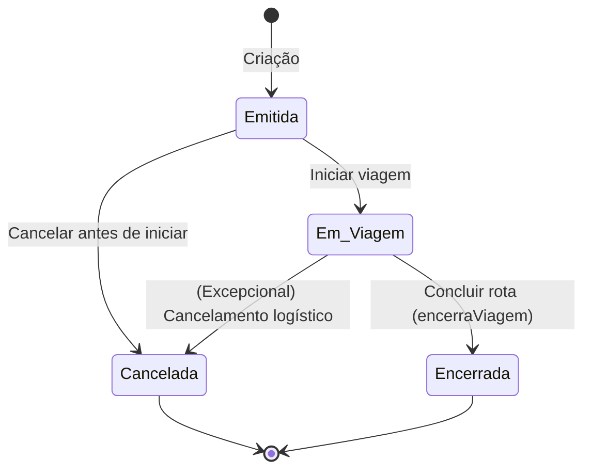
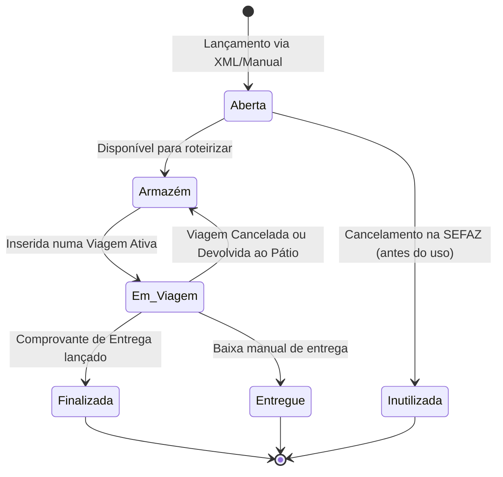
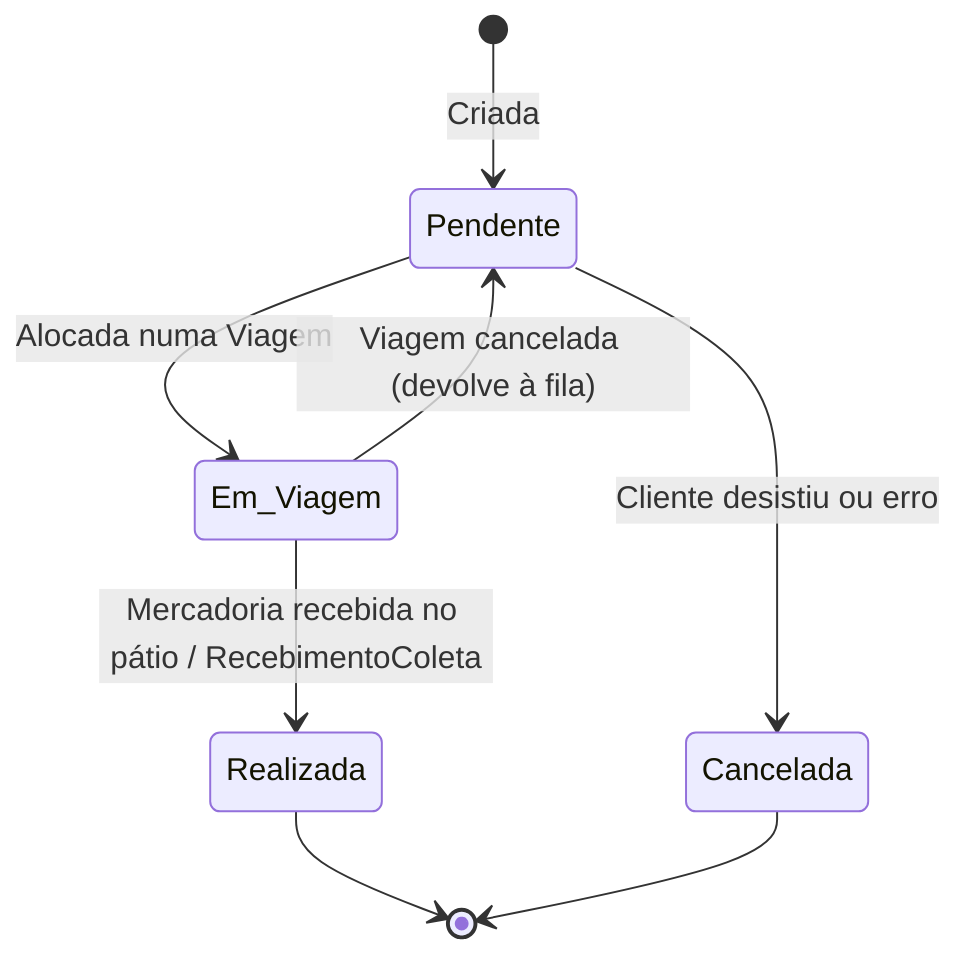
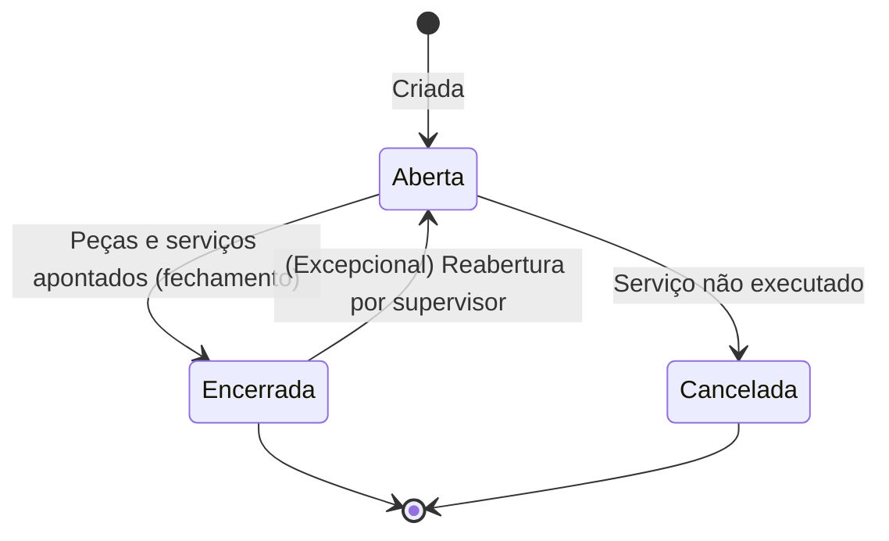

# Máquinas de Estado — salome-legacy

> Gerado pelo Detetive em 2026-06-08
> Escala: 🟢 CONFIRMADO | 🟡 INFERIDO | 🔴 LACUNA

## 1. Viagem

A tabela `viagem` controla os veículos e cargas em trânsito. O campo central é o `status` (String literal no banco).

> **Nota:** Quando a viagem passa para `Cancelada`, o controlador cascateia a alteração para os Conhecimentos e Coletas, forçando `Armazém` e `Pendente` respectivamente. 🟢

---

## 2. Conhecimento de Transporte (CT-e)

Representa o conhecimento fiscal. Acompanha a carga fisicamente. O campo é `situacao`.

> **Nota:** Conhecimentos nascem "Abertos" para manipulação, ficam em "Armazém" aguardando viagem, "Em Viagem" quando alocados, e finalizam com a entrega. 🟡

---

## 3. Coleta

Ordem para o veículo de rua ir buscar a mercadoria no cliente. O campo é `status`.

> **Nota:** Em `RecebimentoColeta.java:1189`, o status vira "REALIZADA" e um CT-e (Conhecimento) com status "ABERTA" é gerado a partir dela. 🟢

---

## 4. Ordem de Serviço (Oficina)

Ordem de manutenção de veículos próprios ou terceiros. O campo é `situacao`.

