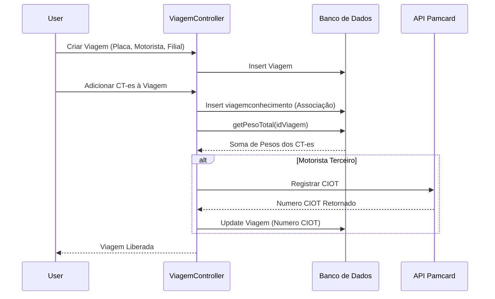
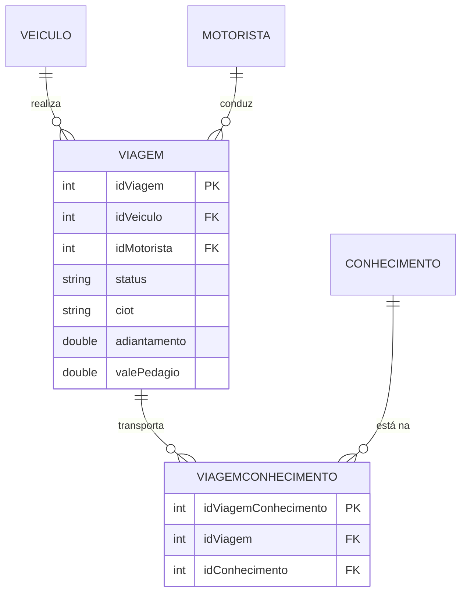

# Design — Módulo viagem

> Gerado pelo Redator em 2026-06-08
> Confiança: 🟢 CONFIRMADO | 🟡 INFERIDO | 🔴 LACUNA

## 1. Decisões Arquiteturais
- O cálculo de peso e roteamento utiliza agregações do banco via queries complexas em `ViagemData`. O controller recupera IDs dos Conhecimentos e os amarra através da tabela associativa `viagemconhecimento`. 🟢
- O envio de dados para a Pamcard é feito por uma camada de integração síncrona dentro da ação de inserção do Controller (sem fila de retentativas nativa). 🟡

## 2. Diagrama de Fluxo Principal (Mermaid)

Fluxo de Abertura de Viagem e Vinculação de CT-e:

## 3. Modelo de Dados Relacional (Core)

